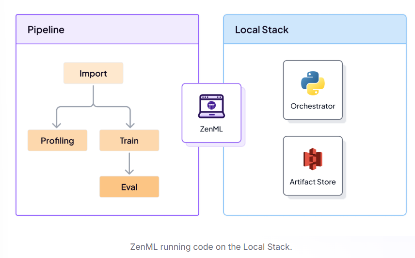

# Day 1 
- Today I understood the use of ZenML for the Development, Execution and Management. Will be Using it for full fledge project of rating customer satisfaction where I will be following Data-centric approach.

- Read Article by Chip Huyen on **Introduction to Machine Learning in Production**

# Day 2
- Successfully created Blueprint for MLOps where I created Data Ingestion, Data Cleaning, Model training, evaluation but working code remains.
- Failed generating blueprint pipeline due to PydanticSchemaGenerationError, tried solving but couldn't will try tom.

