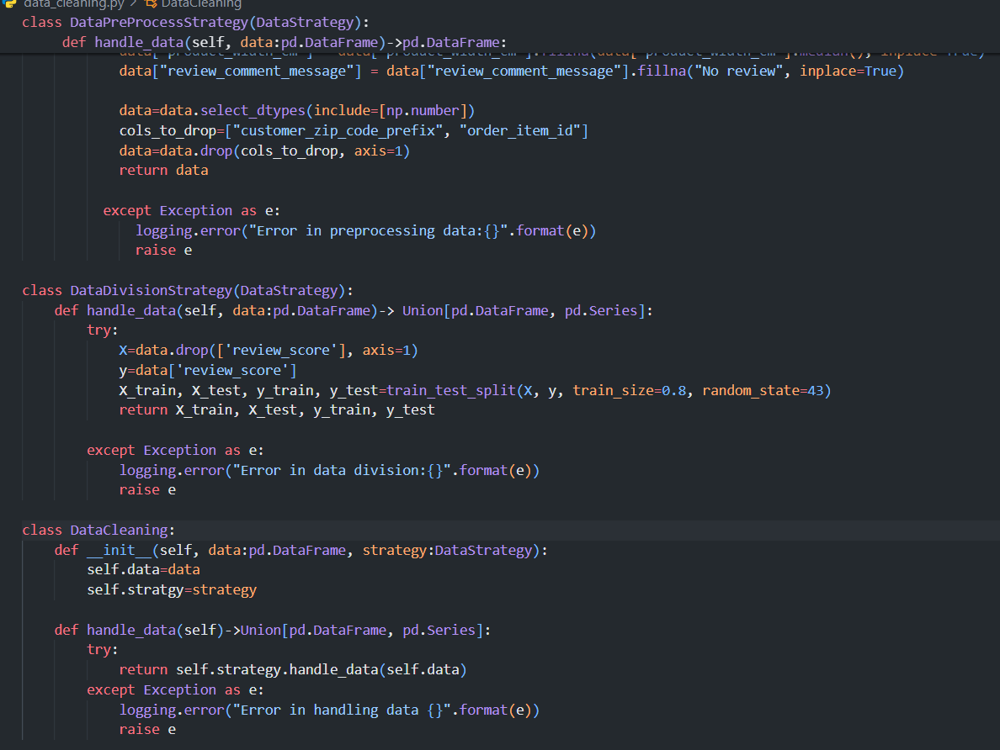
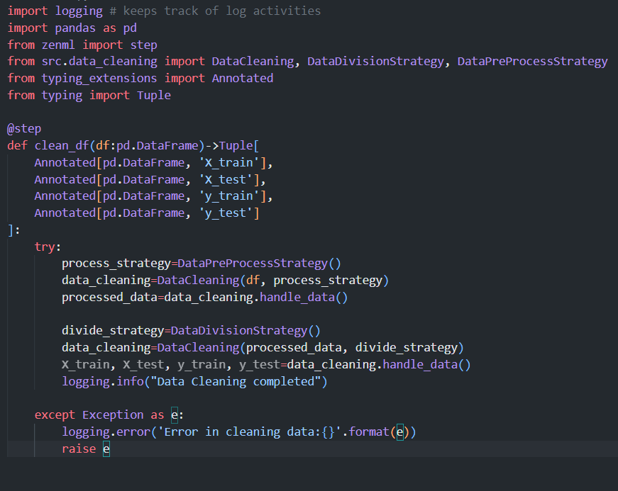
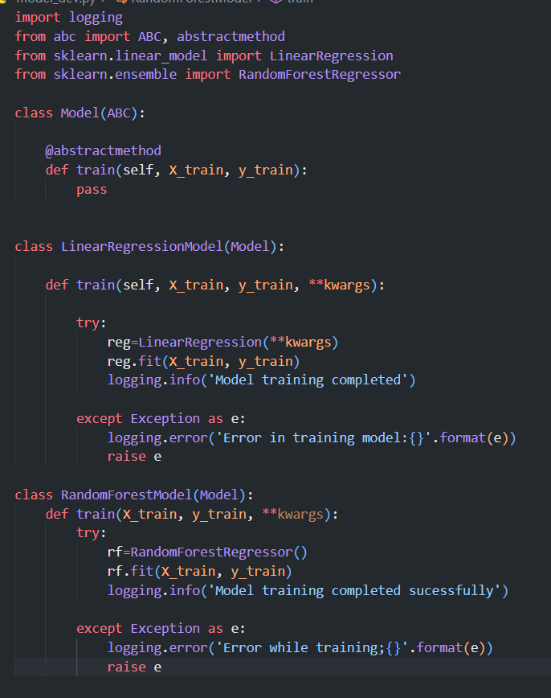
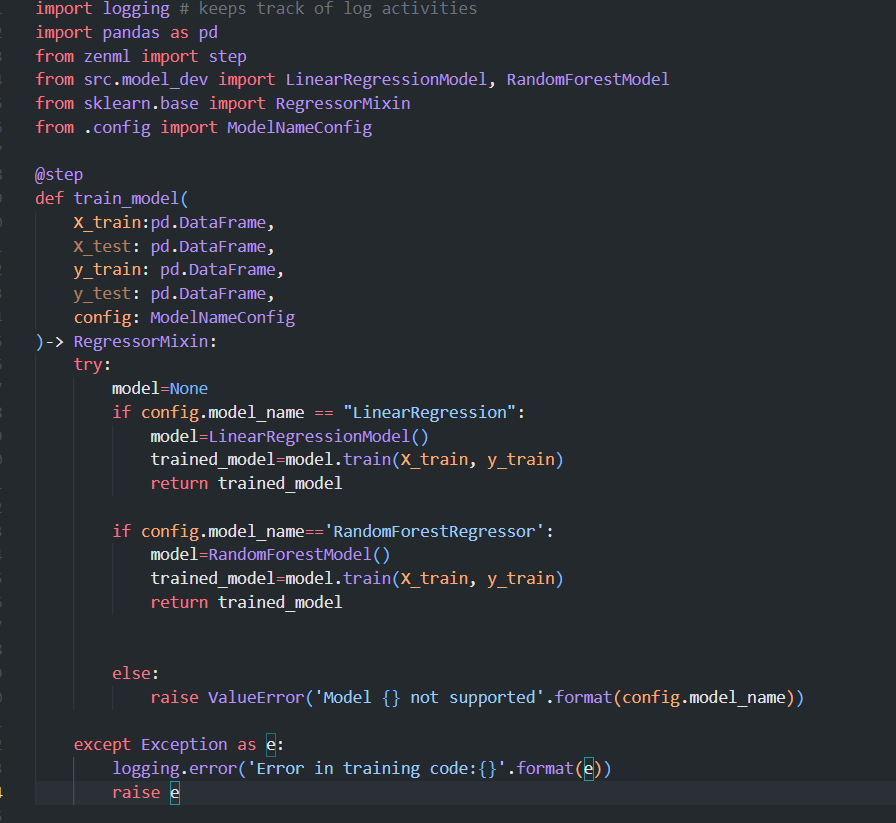
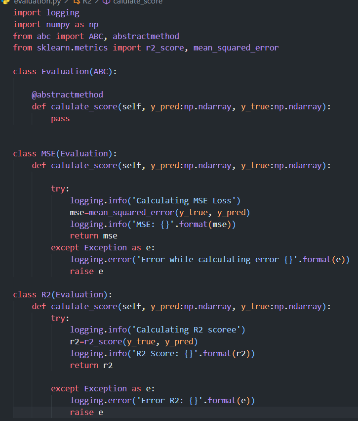
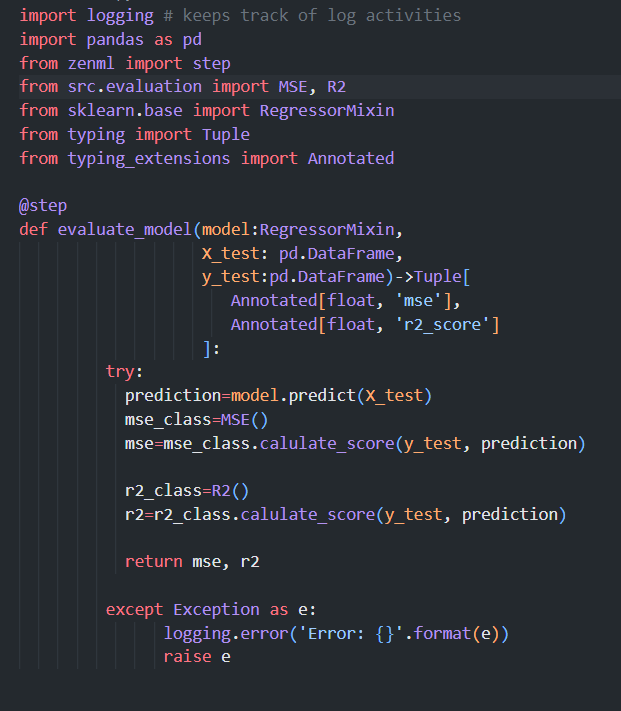
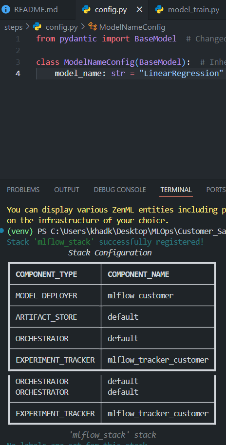
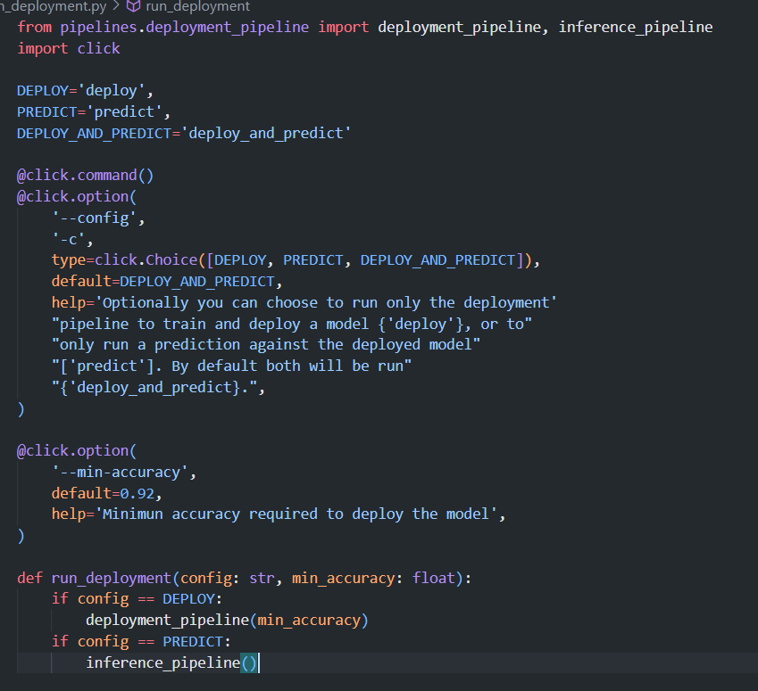

# Day 1 
- Today I understood the use of ZenML for the Development, Execution and Management. Will be Using it for full fledge project of rating customer satisfaction where I will be following Data-centric approach.

- Read Article by Chip Huyen on **Introduction to Machine Learning in Production**

# Day 2
- Successfully created Blueprint for MLOps where I created Data Ingestion, Data Cleaning, Model training, evaluation but working code remains.
- Failed generating blueprint pipeline due to PydanticSchemaGenerationError, tried solving but couldn't will try tom.

# Day 3
- Created file for data cleaning under src where i created abstract class for data strategy. With the help of the function, I created other classes for strategies like DataPreProcessingStrategy, DataDivisionStrategy and Data cleaning.

- Later implemented them in main data cleaning portion in steps.

# Day 4
Just wrote code for model development and training. With the abstract class, We can create as many model for verification which can improve model performance.
Since, the project is really simple i am going to use very basic model.

# Day 5
Completed Building steps on which today the evaluation portion is completed. There has been  issue with the ZenML version need to correct it so that i can rum the pipeline atleast.

# Day 6
- Completed experimental tracking where added model deployer and experimental tracker. Face issue to register local deployer for cloud server, the utimate solution was to disconnet with the server and create container for this.
- Solved the config fuction importing issue with pydantic lib(used for data validation and settings management)

# Day 7
Developed Blueprint for the pipeline deployment where the concept is to make to kinds of pipeline i.e deployment pipeline(used during training) and inference pipeline(used during prediction). will continue to work tomorrow:)

