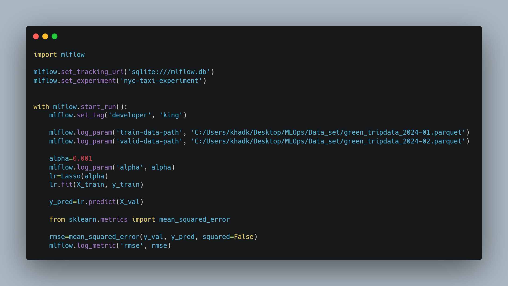
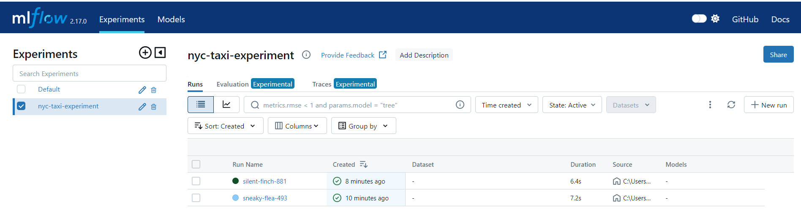

# Day 1 of MLOps
Past 5 months or so, I have been continuosly building model and training them to get accuracies. But along the way, I am came to know about Deployment and maintenance of the system while in real life scenario unlike training in Juypter Notebook. Building the model is a just a tiny piece of work in ML project Lifecycle. This is where MLOps(Machine Learning Operations) comes in place. There are steps in ML project lifecycle which includes:

- **Scoping:**
Here we define the project like on what tech we gonna work, problem statement development and analysis, team management plus resources management. Secondly, We care various metrics such as accuracy, latency, etc.

- **Data:**
It includes Data extraction, warehousing, labelling and preprocessing.

- **Model Building:**
Selecting suitable model and training it. After that validating with test dataset and obtaining the accuracies. The most important part of Model building is hyper-parameter tuning. 

- **Deployment:**
It includes Deployment of the trained model in server for real use case. Similarly, Maintenance come under way which is the longest and the most important part in MLOps. When The model is deployed, we need to constantly monitor the system. 

Now, with times, data tends to change/evolve, so we may need to update and re-evalute our data and most like to re-train our model again. This is the crucial part of MLOps.

# Day 2 of MLOps
Ever thought that is ML project life cycle is linear or circular? If you have read previous prologue then it must be clear that it is circular and to our suprise, we there is no any fixed starting and ending point once you have deployed ML project. **Data Drifting** and **Concept Drifiting** are two important factor considering deployment. 

- **Data Drifting:** When output data changes gradually or suddenly with the input data remains more or less same is called data drifting. For example in House price prediction, where input is Size of house and output is price of house. Now, due inflation or something house price increases while size of house remains constant. This is called data drifting.

- **Concept Drifting:** When both o/p and i/p changes accordingly. when the increasing size of house increases price of house.

- Studied about **Deployment Pattern:**
-> Shadow Deployment, where final decision is made with human consent.
-> Partial Deployment, where the model get confused then human intervention. This is impossible for large companies.

# Day 3 of MLOps
Monitoring plays crucial part in MLOps where ML Project Lifecycle optimizes iteratively. We all know very well that our dies at some point of time even if we have a good quality of data. There are various causes like discussed yesterday where Concept drifting and data drifting plays crucial role.
Similarly, some ML models need to  be retrained on Yearly basis where some needs to be on daily basis. Learnt about inner working monitoring phase in ML Operations. I know these are theory concepts, felt little boring but did it anyway.

# Day 4 of MLOps
Today, I revised model for machine learning using scikit learn to brush up my concept for further days on ml training and deployment. Watched lectures on MLops on Coursea which is more or less theoritical.

.png)

# Day 5 of MLOps
Studied about automation and deployment in MLOps. There are mainly 5 types of **Maturity models** those to helps to clarify the MLOps principles and practise are:

- **No MLOps:** difficult to manage, everything on notebook. it is proof of concept.

- **DevOps but no MLOps:** Contains automated testing, releases are comaparatively.

- **Automated Training:** Contains Automated training and model management.

- **Automated Model Deployment:** Contains integrated A/B test, tracking.

- **Full MLOps automated Operations:** Fully system automated and easily monitored.

Moreover, Implemented MLFlow, a python package containing four module: **Tracking, Models, Model Registry, Projects.**

